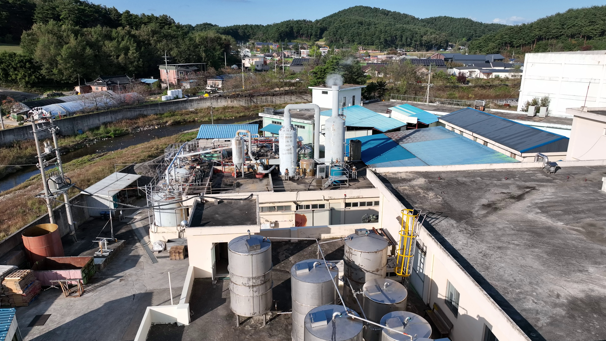
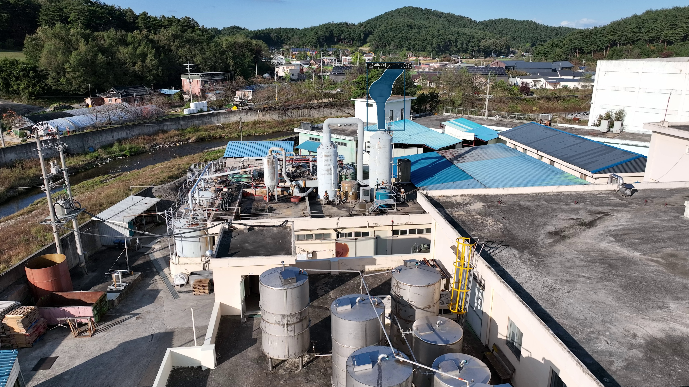

# 🌲 Wildfire AI Model & Soil Moisture Prediction Project

본 프로젝트는 **AI Hub**에서 제공한 `지역안전재난(산불) 방재의 고도화를 위한 대규모 인공지능 데이터베이스 구축` 모델을 기반으로,  
산불 탐지 및 토양 수분 예측 모델 개발 과정을 정리한 저장소입니다.

---

## 📂 Repository Structure
<br>

- `README.md` : 프로젝트 설명 및 사용 가이드
<br>

### Wildfire AI Model
- [`1.모델소스코드.zip`](https://drive.google.com/file/d/1_pSd7Gh8DGMqZEKRrANxaS2EdsJtmn28/view?usp=sharing) : MMDetection 기반 산불 탐지 모델 소스 코드 (압축본)
- [`2.학습모델파일.zip`](https://drive.google.com/file/d/1hxoNkZ0pqLI0WgRrAmWWQUp-p10z8P9G/view?usp=sharing) : 학습된 모델 가중치 파일 (`forest_fire.pth`)
- [`wildfire.zip`](https://drive.google.com/file/d/1P1KGEm729xhpiZaSeFVV0AeDGFlweC_a/view?usp=sharing) : Python 3.10 가상환경(venv) 압축본 (필요 패키지 포함) 


### Soil Moisture Prediction
- [`KSEF_토양수분예측_모델_Preprocessing.ipynb`](KSEF_토양수분예측_모델_Preprocessing.ipynb) : 데이터 수집 및 전처리 과정  
- `KSEF_토양수분예측_모델_Modeling.ipynb` : 머신러닝/딥러닝 모델 설계 및 학습 코드  
- `KSEF_토양수분예측_모델_Evalutation.ipynb` : 모델 성능 평가 및 결과 분석  


---


## 🔥 Wildfire AI Model Usage

### 1) 가상환경 세팅
```bash
unzip wildfire.zip
source wildfire/bin/activate
````

### 2) 모델 실행

```bash
python demo/image_demo.py \
  demo/demo.jpg \
  restored_config.py \
  forest_fire.pth \
  --out result.jpg \
  --device cpu
```

* GPU 사용 시: `--device cuda:0`
* 출력: `result.jpg` 

예시 입력 이미지:


실행 결과 예시:



### 3) Troubleshooting

* `ModuleNotFoundError: mmdet/mmcv/torch` → venv 내 패키지 설치 확인
* `ImportError: mmcv._ext` → `mmcv-full` 재설치
* `RuntimeError: Numpy is not available` → `pip install "numpy<2"`
* 한글 라벨 깨짐 → matplotlib에 한글 폰트 등록 (`AppleGothic`)

---

## 🌱 Soil Moisture Model Development

* 공공데이터 기반 기상·토양 데이터를 수집
* (개발중)
* 모델 구조 및 분석 과정 :  [토양 수분 예측 프로젝트 문서](https://github.com/jwmun38/KSEF)
<br><br>
---

## 📖 Reference

* AI Hub: [지역안전재난(산불) 방재의 고도화를 위한 대규모 인공지능 데이터베이스 구축](https://www.aihub.or.kr/aihubdata/data/view.do?currMenu=115&topMenu=100&dataSetSn=71330)
* OpenMMLab MMDetection: [https://github.com/open-mmlab/mmdetection](https://github.com/open-mmlab/mmdetection)
* Using soil moisture information to better understand and predict wildfire danger: a review of recent developments and outstanding questions: [https://doi.org/10.1071/WF22056](https://doi.org/10.1071/WF22056)
<br><br>
---


